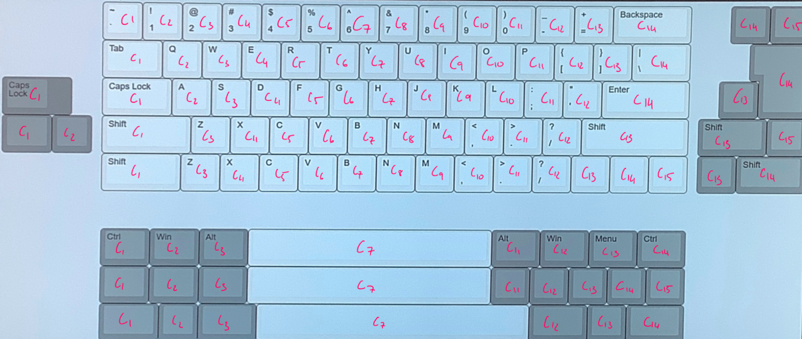

# zmk-config
This is the ZMK-Config repo for the Polarity works CKP series of keyboards, with this you can customise your layout and keymap to suit your exact needs.
We have provided base keymaps for the following layouts on the soldered version: ANSI, ISO, Tsangan and all 1u keys. These can be accessed by choosing the appropriate branch. The hotswap versions now use the exact same firmware as the soldered ones making it harder to end up with an unusable board.

# Layouts
The CKP series has a huge number of available layouts, however most should be configurable within the all 1u keys branch. the boards were designed so that where there is a place where multiple combinations can go, it's always the leftmost set of pins in software. Take the right shift for example, with a maximum of 3 possible keys in it's place however

# Customisation
In order to change the keymap to meet your needs, you will need a GitHub account. Click the "fork" button in the top right to create your own version of the repo, then use the drop down menu to select the branch with your layout.
The keymap information is contained entirely within the file bt60.keymap. Download this file to your computer and open it in a text editor such as Atom or notepad++ then you can open and edit it. The full list of ZMK keycodes can be found [here](https://zmkfirmware.dev/docs/codes/keyboard-keypad/).
After editing the keymap file upload it to the original folder using the "Add file" dialog in GitHub, then click on "Actions" and wait for the build process to complete (The orange dot will go to either a red X or green tick). If your firmware doesn't compile you most likely made a mistake with the keys, use the action log (especially the DTSI file) to find the mistake, double check the .keymap file and try again.

# Compilation and downloading
 If you have made any errors in the keymap the compilation will fail and there will be a red X in the actions dialog. Click on it and it will tell you where the problem is.
 If the build completes with no errors you will be able to find the firmware in the "Artifacts" section of the last action.
 Put the keyboard into bootloader (Either double tap the hardware reset button or use the behaviour, typically fn + enter) and drag and drop the .uf2 file onto the usb drive that shows up

 # More advanced
 If you want to exercise greater control over your CKP and have a unique layout implemented you will need to change the matrix transform. The following diagram displays which keys connect to which row and column pins. Note that everything is zero indexed in the matrix transform, on the BT60V2 and BT65 the rows and colums that aren't present lead to nowhere so dont try and change the indexing, it's meant that way.
 	
  The matrix transform can be found in btXX.dts where XX is the size of the board, more information on how to do the matrix transforms can be found in the official ZMK documentation [here](https://zmkfirmware.dev/docs/development/new-shield#optional-matrix-transform)
  We're always willing to accept pull requests if you've developed your own layouts :)
